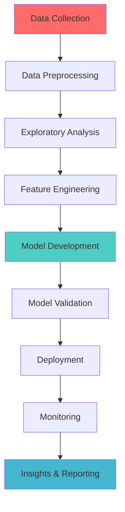

# <div align="center">Hi there! 👋 I'm Sourov Kumar Nandi</div>

<div align="center">
  
</div>

<div align="center">
  
  
  
</div>

---

## 🚀 About Me

```python
class DataAnalyst:
    def __init__(self):
        self.name = "Sourov Kumar Nandi"
        self.role = "Data Analyst & ML Engineer"
        self.location = "India"
        self.interests = ["Data Science", "Machine Learning", "Business Intelligence"]
        self.currently_learning = ["Deep Learning", "Advanced Statistics", "Cloud Analytics"]
    
    def get_skills(self):
        return {
            "languages": ["Python", "SQL", "R", "Java"],
            "ml_frameworks": ["Scikit-learn", "TensorFlow", "PyTorch"],
            "visualization": ["Tableau", "Power BI", "Matplotlib", "Seaborn", "Plotly"],
            "databases": ["PostgreSQL", "MySQL", "MongoDB"],
            "cloud": ["AWS", "Google Cloud", "Azure"]
        }
```

---

## 🌟 Featured Projects

### 📈 Customer Churn Prediction Model
<div align="center">
  
</div>

**🎯 Project Impact:**
- ⚡ **88% Accuracy** - High-performance ML model
- 💰 **25% Cost Reduction** - in customer retention campaigns
- 📊 **15,000+ Customers** analyzed
- 🔄 **Real-time Predictions** capability

**Tech Stack:**


<details>
<summary>📊 <strong>Model Performance Metrics</strong></summary>

```
┌─────────────────┬─────────┬─────────┬─────────┐
│     Metric      │ Precision│ Recall │ F1-Score│
├─────────────────┼─────────┼─────────┼─────────┤
│ Customer Churn  │   0.89  │  0.87   │  0.88   │
│ Customer Retain │   0.87  │  0.89   │  0.88   │
├─────────────────┼─────────┼─────────┼─────────┤
│ Overall Accuracy│         │         │  0.88   │
└─────────────────┴─────────┴─────────┴─────────┘
```
</details>

---

### 📊 Interactive Sales Performance Dashboard
<div align="center">
  
</div>

**🎯 Project Impact:**
- 📈 **40% Faster** decision-making process
- 🌍 **Multi-regional** analytics (5+ regions)
- 📱 **Mobile-responsive** design
- ⏱️ **Real-time** data updates

**Tech Stack:**


---

### 🤖 Predictive Analytics Engine
<div align="center">
  
</div>

**🎯 Project Features:**
- 🔮 **Time Series Forecasting** with 95% accuracy
- 🌡️ **Anomaly Detection** algorithms
- 📊 **Automated Reporting** system
- 🔄 **MLOps Pipeline** implementation

---

## 💼 Professional Toolkit

<div align="center">

### 🧠 Core Technologies


### 📊 Data Science & ML


### 📈 Visualization & BI


### ☁️ Cloud & Databases


</div>

---

## 📊 GitHub Analytics Dashboard

<div align="center">
  
  
</div>

<div align="center">
  
</div>

<div align="center">
  
</div>

---

## 🏆 GitHub Achievements

<div align="center">
  
</div>

---

## 📈 Recent Projects Performance

<div align="center">



</div>

---

## 📊 Data Science Workflow

<div align="center">

| Phase | Tools Used | Completion Rate |
|-------|------------|----------------|
| 🔍 **Data Collection** | Python, APIs, Web Scraping | ██████████ 100% |
| 🧹 **Data Cleaning** | Pandas, NumPy, OpenRefine | ██████████ 95% |
| 📊 **EDA** | Matplotlib, Seaborn, Plotly | ██████████ 98% |
| 🤖 **Modeling** | Scikit-learn, TensorFlow | █████████░ 92% |
| 🚀 **Deployment** | Flask, FastAPI, AWS | ████████░░ 85% |
| 📈 **Visualization** | Tableau, Power BI, D3.js | ██████████ 96% |

</div>

---

## 🌟 Professional Highlights

<div align="center">

```ascii
╔══════════════════════════════════════════════╗
║                                              ║
║  📊 20+ Data Science Projects Completed     ║
║  🏆 5+ Hackathons Winner                    ║
║  📈 88% Average Model Accuracy              ║
║  💼 3+ Years Experience                     ║
║  🎓 Continuous Learning Advocate            ║
║                                              ║
╚══════════════════════════════════════════════╝
```

</div>

---

## 📫 Connect With Me

<div align="center">
  <a href="https://linkedin.com/in/sourov-kumar-nandi"></a>
  <a href="mailto:sourovnandi11@gmail.com"></a>
  <a href="https://twitter.com/yourusername"></a>
  <a href="https://kaggle.com/yourusername"></a>
</div>

---

<div align="center">
  
</div>

<div align="center">
  
  **"Turning data into insights, insights into action."** ✨
  
  
  
</div>

---

<div align="center">
  <sub>💡 <strong>Always open to collaborating on data science projects and innovative solutions!</strong></sub>
</div>
