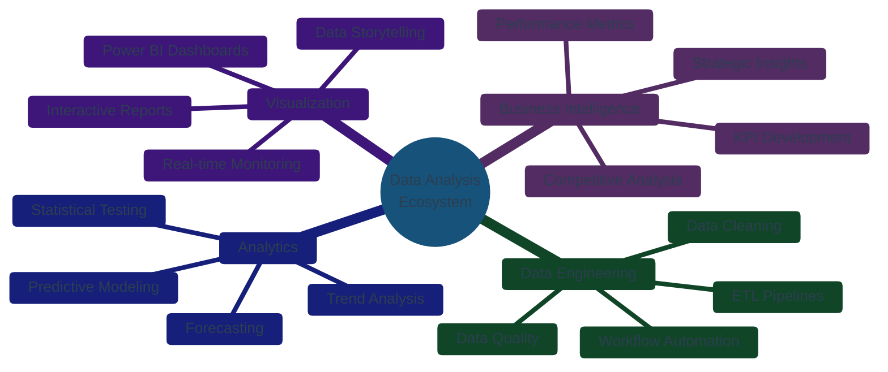

# 
Hi there! 👋 I'm Sourov Kumar Nandi

  

  
  
  

---

## 
🚀 Professional Summary 🚀

  

**Computer Science Engineering Student** at **Chandigarh University** (2022-2026) with a proven track record in data analytics, machine learning, and business intelligence. Specialized in transforming complex datasets into actionable insights through advanced statistical modeling and interactive visualizations. Published researcher with multiple papers in international conferences, actively seeking opportunities to apply data science expertise in real-world business scenarios.

---

## 
🛠️ Technical Arsenal 🛠️

  

### 
**Core Technologies**

<table align="center">
<tr>
<td valign="top" width="50%">

#### 📊 **Data Analysis & Processing**

#### 🗄️ **Database Management**

</td>
<td valign="top" width="50%">

#### 🤖 **Machine Learning & AI**

#### 📈 **Visualization & BI Tools**

</td>
</tr>
</table>

### 
**Development Environment**

  

---

## 
💡 Professional Competencies 💡

  

<table align="center">
<tr>
<td valign="top" width="33%">

### 🔍 **Data Analysis**
- Advanced Statistical Analysis
- Exploratory Data Analysis (EDA)
- Hypothesis Testing
- A/B Testing & Experimentation
- Time Series Analysis
- Regression Modeling

</td>
<td valign="top" width="33%">

### 🎨 **Data Visualization**
- Interactive Dashboards
- Advanced DAX Functions
- KPI Metric Design
- Data Storytelling
- Executive Reports
- Real-time Analytics

</td>
<td valign="top" width="33%">

### 🤖 **Machine Learning**
- Predictive Modeling (96% Accuracy)
- Feature Engineering
- Model Optimization
- Cross-validation
- Ensemble Methods
- Algorithm Selection

</td>
</tr>
</table>

### 
**Domain Expertise**

```mermaid
%%{init: {'theme':'base', 'themeVariables': { 'primaryColor':'#3498db','primaryTextColor':'#2c3e50','primaryBorderColor':'#2980b9','lineColor':'#34495e','secondaryColor':'#9b59b6','tertiaryColor':'#27ae60','background':'#ecf0f1','mainBkg':'#ffffff','secondBkg':'#bdc3c7','tertiaryBorderColor':'#e74c3c','clusterBkg':'#f8f9fa','clusterBorder':'#3498db','titleColor':'#2c3e50','edgeLabelBackground':'#ffffff','nodeTextColor':'#2c3e50'}}}%%
mindmap
  root((Data Analysis<br/>Ecosystem))
    Business Intelligence
      KPI Development
      Performance Metrics
      Strategic Insights
      Competitive Analysis
    Data Engineering
      ETL Pipelines
      Data Cleaning
      Workflow Automation
      Data Quality
    Analytics
      Predictive Modeling
      Statistical Testing
      Trend Analysis
      Forecasting
    Visualization
      Power BI Dashboards
      Interactive Reports
      Data Storytelling
      Real-time Monitoring
```

---

## 
🏆 Key Achievements 🏆

| Achievement | Impact | Technology Stack |
|:---|:---:|---:|
| 🏏 **IPL Analytics Framework** | Interactive insights for cricket analytics | Power BI, SQL, Python |
| ❤️ **Heart Disease Prediction Model** | 96% accuracy in early detection | Python, Scikit-learn, ML |
| 📊 **Sales Performance System** | Real-time business intelligence | Power BI, SQL, DAX |
| 🔄 **Data Processing Automation** | 80% reduction in processing time | Python, Pandas, Automation |
| 📝 **Research Publications** | International conference papers | Statistical Analysis, Research |

---

## 
🎯 Professional Philosophy 🎯

  

> **"Data is the new oil, but insights are the refined fuel that drives business success."**

**Core Values:** Precision • Innovation • Collaboration • Continuous Learning

---

## 
📚 Current Focus 📚

<table align="center">
<tr>
<td valign="top" width="50%">

### 🌱 **Learning Path**
- Advanced Machine Learning Algorithms
- Deep Learning with TensorFlow
- Cloud Computing (AWS, Azure)
- Big Data Technologies (Spark, Hadoop)
- MLOps and Model Deployment
- Advanced Time Series Forecasting

</td>
<td valign="top" width="50%">

### 🎯 **Career Objectives**
- Secure Data Analyst Internship
- Contribute to Open Source Projects
- Build Portfolio of Real-world Projects
- Obtain Industry Certifications
- Network with Industry Professionals
- Publish More Research Papers

</td>
</tr>
</table>

---

## 
📫 Let's Collaborate 📫

   

I'm actively seeking **Data Analyst internship opportunities** and collaborative projects. Whether you're looking for someone to analyze your data, build predictive models, or create insightful dashboards, let's connect!

### **📬 Contact Information**

<table>
<tr>
<td align="center">

 
<strong>Email</strong>
 
<a href="mailto:sourovnandi11@gmail.com">sourovnandi11@gmail.com</a>
</td>
<td align="center">

 
<strong>LinkedIn</strong>
 
<a href="https://linkedin.com/in/sourov-kumar-nandi">Connect with me</a>
</td>
</tr>
</table>

---

  

  
**✨ "Transforming complexity into clarity, one dataset at a time" ✨**

  

*Open to internship opportunities • Available for collaborative projects • Ready to make an impact*

---

  

